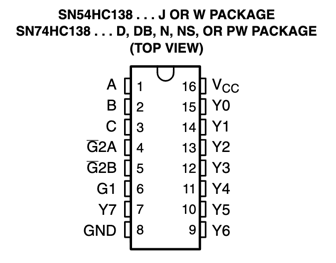
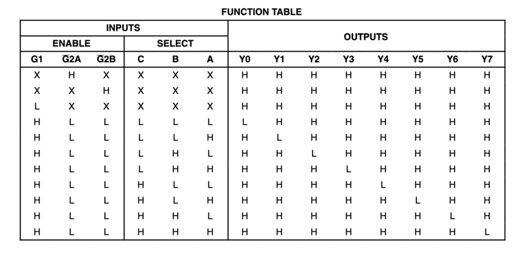

# PCO Exam. Tester for SN74HC138N 3 to 8 decoder/demultiplexer

## Pin-out configuration
* PE7 - Y0
* PE8 - Y1
* PE9 - Y2
* PE10 - Y3
* PE11 - Y4
* PE12 - Y5
* PE13 - Y6
* PE14 - Y7

* PD8 - A
* PD9 - B
* PD10 - C

## Datasheet

* [SN74HC138N on alldatasheet.com](https://pdf1.alldatasheet.com/datasheet-pdf/download/355516/TI/SN74HC138N.html)

## Task:
Test the SN74HC138N 3 to 8 decoder. For all combinations of A, B, C test if the correct Y0-Y7 are set.

### Implementation details:
* The SN74HC138N 3 to 8 decoder is tested by setting A, B, C to all possible combinations and checking if the correct Y0-Y7 are set.
* The A, B, C pins are set by the set_SELECT function.
* The Y0-Y7 pins are read by the read_OUTPUT function.
* The ERROR_blink function is called if the test fails.
* The onetime_OK_blink function is called if the test passes.
*
* During the testing, the BLUE LED will blink on each successful test, and the ORANGE LED will blink on each failed test.
* If the test fails, the RED LED will blink.
* If decoder works correctly, the GREEN LED will light up continuously.

> **Note**
> 
> Program is testing only one time.

## License
The [MIT](https://choosealicense.com/licenses/mit/) License (MIT)

Copyright © 2023. Andrii Yaroshevych
